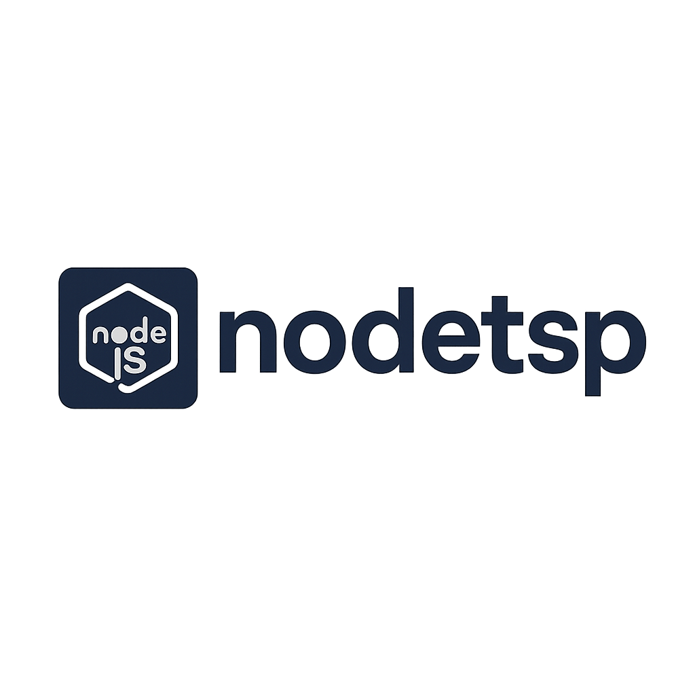

<div align="center">
  
</div>

# NodeTSP

> **Kickstart your Node.js + TypeScript projects with zero configuration.**

[](https://www.npmjs.com/package/nodetsp) [](LICENSE) [](https://nodejs.org/) [](CONTRIBUTING.md)

## 📋 Overview

**NodeTSP** is a CLI scaffolding tool that automates the setup of Node.js projects with TypeScript, ESLint, Prettier, and Git. Spend less time on boilerplate and more time writing code.

## ✨ Features

- 🚀 Full ESM & modern TypeScript support
- 🧹 Pre-configured ESLint & Prettier for consistent style
- 🔄 Automatic Git repository initialization
- 📁 Customizable folder structure
- 🛠️ One-command project scaffolding

## 📦 Installation

```bash
npm install -g nodetsp
# or
pnpm add -g nodetsp
```

## 🚀 Quick Start

```bash
# Create a new project to start the cli prompts
nodetsp init 

# Choose pnpm instead of npm
nodetsp init my-project --package-manager pnpm

# Use CommonJS and create extra folders
nodetsp init my-project \
  --module-system commonjs \
  --folders utils,types \
  --git

# Non-interactive (all options in one go)
nodetsp init my-project \
  --package-manager pnpm \
  --module-system esm \
  --folders lib,utils,config,types \
  --git
```

## 📋 CLI Options

| Option                            | Description                                                   | Default    |
| --------------------------------- | ------------------------------------------------------------- | ---------- |
| `-p, --package-manager <manager>` | Package manager: `npm` or `pnpm`                              | `npm`      |
| `-m, --module-system <system>`    | Module system: `esm` or `commonjs`                            | `commonjs` |
| `-f, --folders <folders>`         | Comma-separated extra folders: `lib,utils,config,types,tests` | none       |
| `-g, --git`                       | Initialize a Git repository                                   | `false`    |
| `-v, --version`                   | Display version                                               | —          |
| `-h, --help`                      | Show help                                                     | —          |

## 📂 Generated Project Structure

```
my-project/
├── src/
│   └── index.ts
├── dist/
├── .eslintrc.js
├── .prettierrc
├── .gitignore
├── tsconfig.json
└── package.json
```

<details>
<summary>Example Output</summary>

```bash
$ nodetsp init my-project
✔ Creating project directory
✔ Initializing package.json
✔ Configuring TypeScript, ESLint & Prettier
✔ Setting up Git repository
✔ Installing dependencies (npm)
🎉 Project "my-project" is ready! cd my-project && npm install
```

</details>

## 👥 Contributing

We welcome contributions! Please read our [Contributing Guidelines](CONTRIBUTING.md) before opening an issue or pull request.

## 🔒 License

This project is licensed under the [MIT License](LICENSE).
